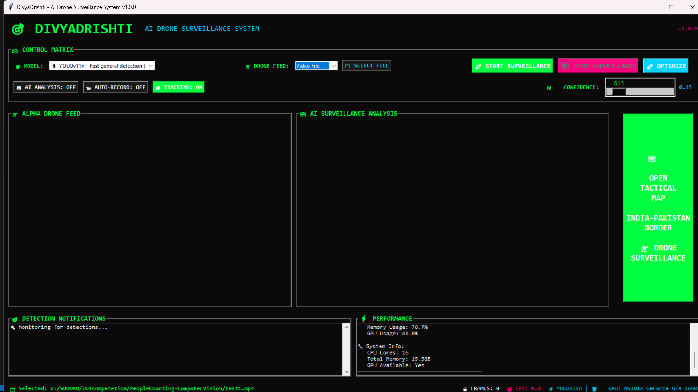
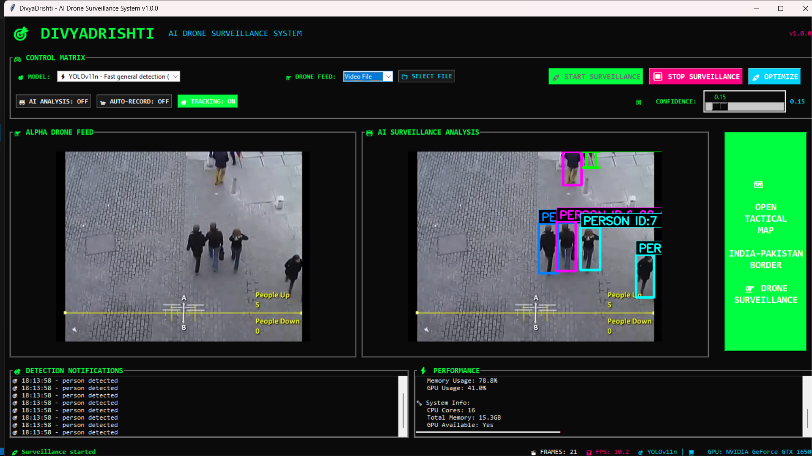
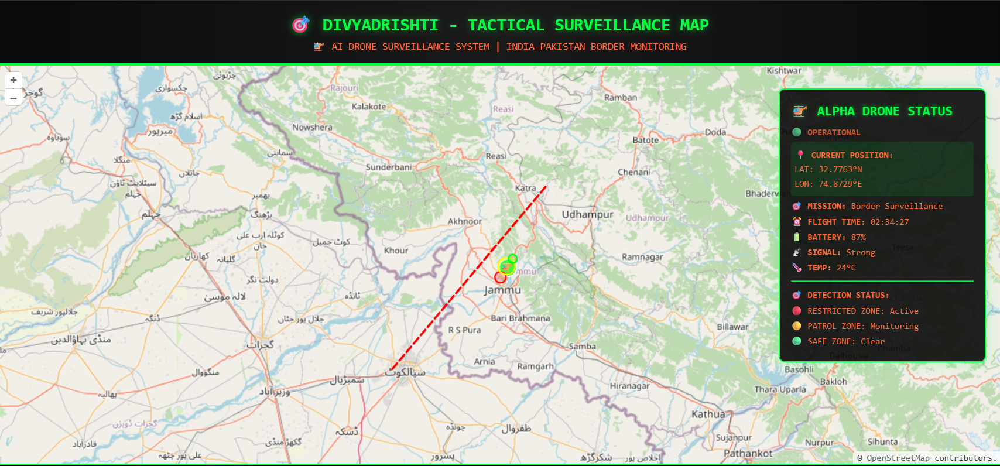

# 🚁 DivyaDrishti - AI-Powered Drone Border Surveillance System

<div align="center">


**Advanced AI-Powered Drone Border Surveillance System for Unauthorized Trail Detection**

[](https://python.org)
[](https://pytorch.org)
[](https://ultralytics.com)
[](https://developer.nvidia.com/cuda-zone)
[](LICENSE)

</div>

## 🌟 Overview

**DivyaDrishti** is a cutting-edge AI-powered drone border surveillance system specifically designed for detecting unauthorized trails, human intrusions, and suspicious activities in restricted border zones. Built with state-of-the-art computer vision technology, it features **custom-trained YOLO models** for specialized border security scenarios, wrapped in a professional tactical interface.

### 📸 Application Screenshots

<div align="center">

### 🖥️ Main Interface - Ready for Surveillance


*Professional cyberpunk-themed surveillance interface featuring the control matrix, model selection (YOLOv11n), dual-panel layout for drone feed and AI analysis, performance monitoring, and tactical map integration. The clean, organized design provides intuitive access to all surveillance functions.*

---

### 🎯 AI Detection in Action - Real-Time Person Tracking


*Advanced AI detection system actively tracking multiple individuals with persistent IDs (PERSON ID:7, etc.). Features color-coded bounding boxes, real-time detection notifications with timestamps, and performance metrics showing 21 FPS processing speed. The system demonstrates robust multi-person tracking capabilities.*

---

### 🗺️ Tactical Surveillance Map - Border Monitoring


*Interactive tactical map interface showing real-world India-Pakistan border surveillance operations. Includes Alpha drone status panel with GPS coordinates, mission details, flight time tracking, detection status indicators, and professional military-grade interface design for strategic border monitoring.*

</div>

### 🎬 Demo Videos & Presentation

<div align="center">

### 🎥 YouTube Demonstrations

| Demo Video 1 | Demo Video 2 |
|:---:|:---:|
| [](https://youtu.be/TrUjXULmhlQ) | [](YOUTUBE_URL_2_HERE) |
| *Application Overview & Features* | *AI Detection & Tracking Demo* |

### 📊 Project Presentation
[](https://drive.google.com/file/d/1f9MaNopNNxVizS0-yqrtbOhaFWTapv9L/view?usp=sharing)

*Comprehensive project overview, technical details, and implementation insights*

</div>

### 🎯 Key Highlights
- **Border Security Focus**: AI-powered detection of unauthorized crossings and illegal trails
- **Real-time Threat Detection**: GPU-accelerated processing with 25-30 FPS performance
- **Multi-Model Intelligence**: Dynamic switching between YOLOv11 variants for different scenarios
- **Persistent Object Tracking**: YOLO11 tracking with ByteTrack for continuous person monitoring
- **Tactical Command Interface**: Professional cyberpunk-themed interface for security operations
- **Comprehensive Intelligence**: Advanced detection tracking and evidence logging


## 🚀 Features

### 🤖 AI Detection Capabilities
- **🚨 Unauthorized Trail Detection**: Specialized model trained for illegal border crossings
- **👤 Human Intrusion Detection**: Real-time detection of unauthorized personnel with persistent tracking
- **🎯 Object Tracking**: YOLO11 tracking with ByteTrack for continuous person monitoring
- **🏷️ Persistent IDs**: Each detected person gets a unique tracking ID across video frames
- **🌿 Terrain & Environment Analysis**: Natural cover, concealment areas, and crossing points
- **📦 Suspicious Equipment Recognition**: Detection of smuggling equipment and contraband
- **🎯 Multi-Class Border Security**: 8+ specialized border surveillance classes

### ⚡ Advanced Technology
- **🔄 Real-time Processing**: Live drone feed analysis with GPU acceleration
- **🎯 Persistent Tracking**: YOLO11 tracking with ByteTrack algorithm for stable annotations
- **🎨 Color-coded Tracking**: Different colors for each tracked person/object
- **🤖 AI Segmentation**: Toggle between detection and segmentation modes
- **📊 Performance Monitoring**: Real-time FPS and system metrics
- **💾 Intelligence Logging**: Comprehensive threat detection and evidence logging
- **📸 Evidence Capture**: Automatic screenshot and video recording of security events
- **🗺️ Tactical Mapping**: Interactive drone location and threat visualization

### 🎮 Command Interface
- **🌌 Professional Theme**: Dark tactical interface with security-focused design
- **📱 Intuitive Controls**: Easy-to-use detection controls for security personnel
- **🎯 Tracking Controls**: Toggle persistent tracking on/off with visual feedback
- **📊 Live Dashboard**: Real-time threat assessment and detection statistics
- **🔧 Dynamic Configuration**: Hot-swappable models for different surveillance scenarios
- **📹 Multi-source Input**: Drone feeds, security cameras, and surveillance streams

## 🛠️ Technology Stack

### 🧠 AI/ML Framework
```
🔥 PyTorch 2.5.1+        # Deep learning framework with CUDA support
🎯 Ultralytics YOLOv11   # State-of-the-art object detection
🖼️ OpenCV 4.11.0+        # Computer vision and image processing
🔢 NumPy & Pandas        # Data processing and numerical computing
⚡ CUDA 12.1             # GPU acceleration for real-time processing
```

### 💻 Core Technologies
```
🐍 Python 3.8+          # Primary programming language
🖥️ Tkinter               # GUI framework with custom styling
🧵 Threading             # Multi-threaded processing
📊 JSON/CSV              # Data logging and export
🌐 HTML/JavaScript       # Tactical map interface
```

### 🎨 Additional Libraries
```
🖼️ Pillow (PIL)          # Image processing and manipulation
📁 Pathlib               # Modern path handling
⏰ DateTime              # Timestamp management
🌐 Webbrowser            # Tactical map integration
```

## 🎯 Custom Border Surveillance Detection Model

### 🏗️ Model Architecture
- **Base**: YOLOv11 architecture optimized for border security environments
- **Training Data**: Custom dataset of border crossings, unauthorized trails, and restricted zones
- **Classes**: 8 specialized border surveillance detection classes
- **Performance**: 25-30 FPS on NVIDIA GTX 1650, 54.8MB model size

### 🚨 Detection Classes
```
🌱 grass          # Ground cover and concealment areas
🪨 rock           # Rock formations and natural barriers
🥾 unauthorized-trail    # Illegal crossing paths and smuggling routes
🌳 roots          # Natural obstacles and concealment points
🛤️ rough-terrain    # Difficult crossing areas and natural barriers
🏗️ structure      # Border infrastructure and security installations
🌲 tree-trunk     # Large vegetation providing cover
🌿 vegetation     # Natural concealment and hiding spots
```

### 📊 Model Performance
- **Accuracy**: High precision for border security threat detection
- **Speed**: Real-time processing at 25-30 FPS (GPU)
- **Size**: Optimized 54.8MB model for efficient field deployment
- **Compatibility**: CUDA-accelerated with CPU fallback for remote operations

## 📁 Project Structure

```
DivyaDrishti/
├── 🎯 main.py                      # Application entry point
├── 🎮 gui_app.py                   # Cyberpunk-themed GUI interface
├── 🤖 object_detector.py           # Multi-model YOLO detector with tracking
├── 📊 detection_logger.py          # Simplified notification logging
├── ⚡ performance_monitor.py       # Real-time performance tracking
├── 🔧 config.py                    # System configuration
├── 🛠️ utils.py                     # Utility functions and helpers
├── 🎞️ frame_processor.py           # Video frame processing and optimization
├── 🎛️ optimization_panel.py        # Performance optimization controls
├── 🔧 model_optimizer.py           # AI model optimization engine
├── 📋 requirements.txt             # Python dependencies
├── 🎯 bytetrack.yaml               # ByteTrack tracking configuration
├── 🎯 divyadrishti_tracker.yaml    # Custom BoT-SORT tracking configuration
├── 🗺️ tactical_map.html            # Interactive map interface
├── 🚀 Installation Scripts/
│   ├── install.bat                 # Windows installation
│   ├── install.sh                  # Linux/macOS installation
│   ├── install_dependencies.py     # Python dependency installer
│   └── install_optimization_deps.py # Performance optimization installer
├── 🎯 AI Models/                   # Production-ready models (210.2 MB)
│   ├── foottrail.pt               # Custom FootTrail detection (54.8 MB)
│   ├── yolo11n.pt                 # Fast person detection (5.6 MB)
│   ├── yolo11s.pt                 # Balanced performance (19.3 MB)
│   ├── yolo11m.pt                 # High accuracy (40.7 MB)
│   ├── yolo11s-seg.pt             # Segmentation mode (20.7 MB)
│   └── *.onnx                     # Optimized ONNX versions
├── 📁 logs/                        # Detection logs (cleaned)
├── 📁 Models/optimized/            # Cached optimized models
└── 📄 LICENSE                      # MIT License
```

## 🚀 Quick Start Guide

### 📋 Prerequisites
- **Python**: 3.8 or higher
- **GPU**: NVIDIA GPU with CUDA support (recommended)
- **RAM**: 8GB+ (16GB recommended)
- **Storage**: 2GB free space
- **Input**: Webcam or video files for testing

### ⚡ Installation

#### 1️⃣ Clone Repository
```bash
git clone https://github.com/didaco97/DivyaDrishtiAI.git
cd DivyaDrishtiAI
```

#### 2️⃣ Install Dependencies
```bash
# 🪟 Windows (Recommended)
install.bat

# 🐧 Linux/macOS
chmod +x install.sh
./install.sh

# 🐍 Manual Installation
python install_dependencies.py
pip install -r requirements.txt

# ⚡ Performance Optimization (Optional)
python install_optimization_deps.py
```

#### 3️⃣ Verify Installation
```bash
python main.py --check
```

#### 4️⃣ Launch Application
```bash
python main.py
```

### 🎮 First Run
1. **Select Input Source**: Choose drone feed, security camera, or surveillance stream
2. **Choose Model**: Select YOLOv11n for person detection (recommended) or FootTrail for terrain analysis
3. **Enable Tracking**: Click "🎯 TRACKING: OFF" to turn it ON for persistent annotations
4. **Adjust Confidence**: Lower the confidence slider to 10-15% for better person detection
5. **Start Surveillance**: Click "🚀 START SURVEILLANCE"
6. **Monitor Threats**: View real-time detections with persistent tracking IDs

## 🔧 Configuration & Customization

### ⚙️ System Configuration
Edit `config.py` to customize:
```python
# Detection Settings
CONFIDENCE_THRESHOLD = 0.15     # Lowered for better person detection
DEFAULT_MODEL_KEY = "yolov11n"  # YOLOv11n for person detection
ENABLE_GPU = True               # GPU acceleration for real-time processing

# Tracking Settings
USE_TRACKING = True             # Enable persistent object tracking
SMART_FRAME_SELECTION = False   # Disabled for tracking continuity
ADAPTIVE_SKIP_FRAMES = False    # Disabled for tracking continuity

# GUI Settings
CYBERPUNK_THEME = {             # Professional interface styling
    "primary_color": "#00ff41",
    "bg_color": "#0a0a0a"
}

# Performance Settings
MAX_FPS = 30                    # Maximum processing FPS
SKIP_FRAMES = 1                 # Frame processing interval
```

### 🎯 Adding Custom Models
1. Place model file in `Models/` directory
2. Update `AVAILABLE_MODELS` in `config.py`:
```python
"custom_model": {
    "name": "Custom Model Name",
    "path": "path/to/model.pt",
    "classes": ["class1", "class2"],
    "icon": "🎯"
}
```
3. Restart application

## 🎮 User Interface Guide

### 🎛️ Main Controls
- **🚀 START SURVEILLANCE**: Begin real-time AI detection and tracking
- **⏹️ STOP SURVEILLANCE**: Stop detection process
- **📹 SOURCE**: Select input source (camera/video/stream)
- **🎯 MODEL**: Switch between available YOLO models
- **🎯 TRACKING**: Toggle persistent object tracking ON/OFF
- **🤖 AI ANALYSIS**: Toggle segmentation mode
- **📹 AUTO-RECORD**: Toggle automatic video recording
- **📸 SCREENSHOT**: Capture current frame
- **🚀 OPTIMIZE**: Open performance optimization panel
- **🗺️ TACTICAL MAP**: Open interactive map
- **🔄 RESTART**: Restart application

### 📊 Information Panels
- **🎯 Threat Alerts**: Real-time security breach notifications
- **📈 Performance Monitor**: Real-time FPS and system metrics
- **🗺️ Drone Location**: GPS coordinates and surveillance sector information
- **⚙️ System Status**: Model info and security device status

### 🎚️ Settings Panel
- **Confidence Threshold**: Adjust detection sensitivity
- **Auto-save Screenshots**: Toggle automatic capture
- **Performance Monitoring**: Enable/disable metrics tracking

## 🚨 Troubleshooting

### ❌ Common Issues

#### Model Not Found
```
✗ FootTrail model not found
```
**Solution**: Ensure model is at: `DivyaDrishti/foottrail.pt` (models are now in the main directory)

#### GPU Not Available
```
⚠️ GPU not available, using CPU
```
**Solutions**:
1. Install NVIDIA CUDA Toolkit 12.1+
2. Reinstall PyTorch with CUDA: `pip install torch torchvision --index-url https://download.pytorch.org/whl/cu121`
3. Update GPU drivers

#### Dependencies Missing
```
✗ Missing dependencies: torch, ultralytics
```
**Solution**: Run installation script or `pip install -r requirements.txt`

### 🐛 Performance Issues
- **Low FPS**: Enable GPU acceleration or reduce confidence threshold
- **High Memory Usage**: Restart application or close other programs
- **Detection Lag**: Reduce video resolution or increase frame skip

#### Tracking Issues
```
⚠️ Tracking annotations flickering
```
**Solutions**:
1. Enable tracking: Click "🎯 TRACKING: OFF" to turn it ON
2. Lower confidence threshold to 10-15%
3. Ensure YOLOv11n model is selected
4. Disable frame skipping in config.py

#### Low Detection Rate
```
⚠️ People not being detected
```
**Solutions**:
1. Lower confidence slider to 10-15%
2. Switch to YOLOv11n model for person detection
3. Ensure good lighting in video feed
4. Check if 'person' class is in model

### 🔍 Debug Mode
```bash
python main.py --debug    # Enable debug logging
python main.py --version  # Show version info
python main.py --check    # System diagnostics
```

## 🆕 Recent Updates & Improvements

### ✨ Version 1.0.0 - Production Release
- **🎯 Persistent Object Tracking**: Implemented YOLO11 tracking with ByteTrack algorithm
- **🏷️ Stable Annotations**: Each person gets a unique, persistent tracking ID
- **🎨 Color-coded Tracking**: Different colors for different tracked objects
- **🧹 System Cleanup**: Removed 17.3 MB of unnecessary files for production deployment
- **📁 Model Reorganization**: Simplified model paths for faster loading
- **⚡ Performance Optimization**: Enhanced GPU acceleration and memory management
- **🔧 Configuration Updates**: Lowered default confidence for better person detection
- **🎛️ Enhanced GUI**: Added tracking controls and optimization panel

### 🎯 Tracking Features
- **Persistent IDs**: Track people across video frames with consistent annotations
- **ByteTrack Algorithm**: Robust tracking that handles occlusions and re-identification
- **Visual Feedback**: Green "🎯 TRACKING: ON" button shows tracking status
- **Confidence Optimization**: Lowered to 15% for better person detection
- **Frame Continuity**: Disabled frame skipping for smooth tracking

### 🧹 System Optimization
- **Production Ready**: Cleaned system with only essential files (210.2 MB total)
- **Faster Startup**: Removed test files and cache for quicker loading
- **Simplified Paths**: Models now directly in main directory
- **Auto-cleanup**: Old logs and temporary files automatically managed

## 📊 Performance Benchmarks

### 🖥️ Tested Hardware
| Component | Specification |
|-----------|---------------|
| **GPU** | NVIDIA GeForce GTX 1650 |
| **CPU** | Intel i7-10750H |
| **RAM** | 16GB DDR4 |
| **CUDA** | 12.1 |

### ⚡ Performance Metrics
| Metric | GPU Performance | CPU Performance |
|--------|----------------|-----------------|
| **Detection FPS** | 25-30 FPS | 8-12 FPS |
| **Model Loading** | 3-5 seconds | 5-8 seconds |
| **Memory Usage** | 2-4GB | 1-2GB |
| **Inference Time** | 33-40ms | 80-125ms |

## 🤝 Contributing

We welcome contributions to DivyaDrishti! Here's how you can help:

### 🔧 Development Setup
1. Fork the repository
2. Create a feature branch: `git checkout -b feature/amazing-feature`
3. Make your changes
4. Add tests if applicable
5. Commit changes: `git commit -m 'Add amazing feature'`
6. Push to branch: `git push origin feature/amazing-feature`
7. Submit a Pull Request

### 📝 Contribution Guidelines
- Follow Python PEP 8 style guidelines
- Add docstrings to new functions
- Update documentation for new features
- Test on both GPU and CPU environments

## 📄 License

This project is licensed under the MIT License - see the [LICENSE](LICENSE) file for details.

## 👥 Development Team

**DivyaDrishti** is developed and maintained by:

### 🎯 Lead Developer
**Dhiraj Dahale** - *Project Lead & AI Engineer*
- 🔗 GitHub: [@didaco97](https://github.com/didaco97)
- 📧 Email: dhirajdahale96@gmail.com
- 💼 LinkedIn: [Dhiraj Dahale](https://www.linkedin.com/in/dhiraj-dahale-028b6229b)

### 🤝 Development Team
- **AI/ML Engineering**: Custom model training and optimization
- **Computer Vision**: Real-time detection and tracking systems
- **GUI Development**: Cyberpunk-themed interface design
- **Performance Optimization**: GPU acceleration and system optimization

### 🙏 Acknowledgments
- **Ultralytics Team** for the excellent YOLO framework
- **PyTorch Community** for the robust deep learning platform
- **OpenCV Contributors** for computer vision capabilities
- **Open Source Community** for inspiration and support

## 🆘 Support & Contact

### 📞 Getting Help
1. **Documentation**: Check this README and system docs
2. **Issues**: Create a GitHub issue for bugs or feature requests
3. **Discussions**: Use GitHub Discussions for questions
4. **Email**: Contact the development team directly

### 🔗 Links
- **Repository**: [https://github.com/didaco97/DivyaDrishtiAI](https://github.com/didaco97/DivyaDrishtiAI)
- **📊 Project Presentation**: [PowerPoint Slides](https://drive.google.com/file/d/1f9MaNopNNxVizS0-yqrtbOhaFWTapv9L/view?usp=sharing)
- **Documentation**: [Wiki](https://github.com/didaco97/DivyaDrishtiAI/wiki)
- **Issues**: [Bug Reports](https://github.com/didaco97/DivyaDrishtiAI/issues)
- **Releases**: [Latest Releases](https://github.com/didaco97/DivyaDrishtiAI/releases)

### 📊 System Information
```bash
# Get detailed system info
python main.py --version
python main.py --check
python main.py --debug
```

---

<div align="center">

**🚁 DivyaDrishti v1.0.0** - *AI-Powered Drone Border Surveillance System*

*Developed with ❤️ by Dhiraj Dahale and Team*

[](https://github.com/didaco97/DivyaDrishtiAI/stargazers)
[](https://github.com/didaco97/DivyaDrishtiAI/network/members)
[](https://github.com/didaco97/DivyaDrishtiAI/issues)

</div>
